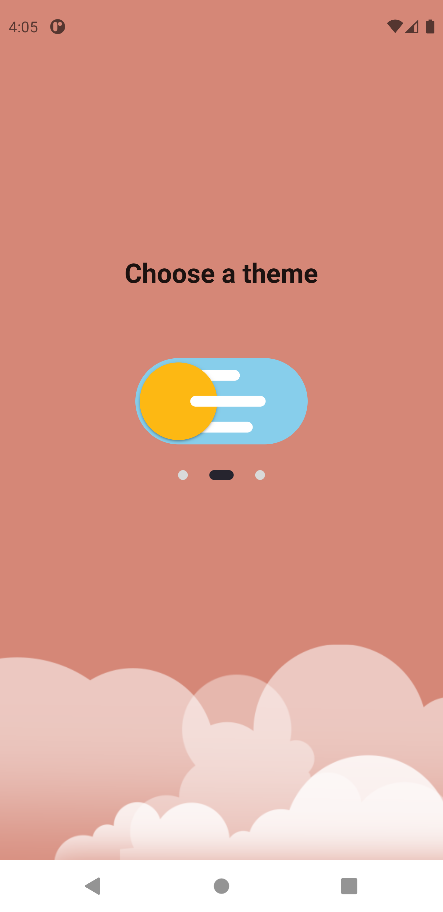

# Flutter Theme Changer

Flutter app made using hive and provider to change theme of the phone.
*Works on both iOS and Android*

<p align = "center" >

  </p>

## Run App
1. Open terminal
2. Clone Repo 
    ```
     https://github.com/arpita505/FlutterThemeChanger.git
     ```
3. Connect a device/emulator (iOS/Android)
4. Run the following command in the terminal 
     ```
     flutter run
     ```
     
